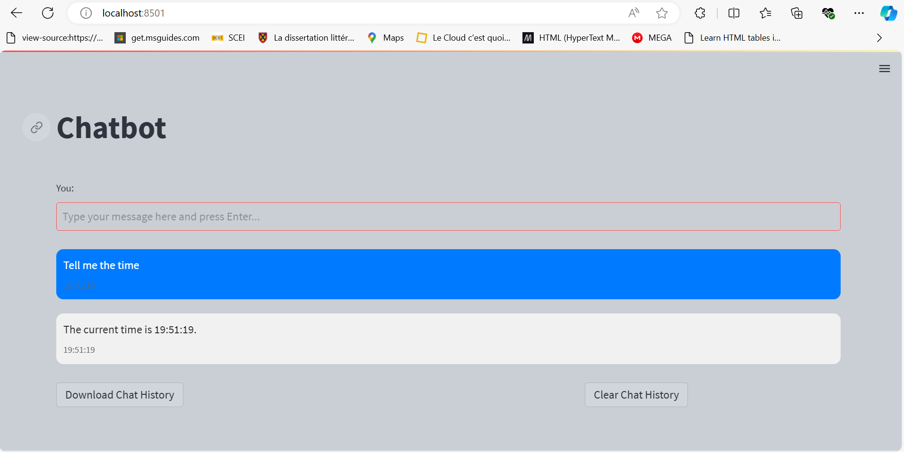

# Chatbot Project

## Purpose
The purpose of this chatbot is to provide an interactive conversational agent that can respond to user inputs with relevant and pre-defined responses. The chatbot is built using natural language processing techniques and can be easily extended to handle various intents, including checking the weather, telling the current time, and answering predefined questions.

## Features

- Interactive chat interface using Streamlit
- Predefined intents with pattern matching and responses
- Weather checking functionality
- Current time reporting
- Easy-to-extend intents and responses
- User-friendly design with clear and concise interactions
- **Download chat history** button
- **Clear chat history** button

## Project Structure
- `Chatbot.py`: Main application file containing the Streamlit interface and chatbot logic.
- `README.md`: This documentation file.

## Extending the Chatbot
To add new intents and responses:
1. Update the `intents` list in `Chatbot.py` with new patterns and responses.
2. Retrain the classifier if necessary by updating the training data.

